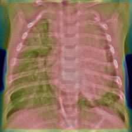

# Pneumonia Detection from Chest X-Rays with Grad-CAM Explainability

## 1. Problem Statement
Pneumonia is a potentially life-threatening lung infection that requires early and accurate diagnosis. 
Chest X-rays are commonly used for diagnosis, but interpretation can be subjective and time-consuming.

This project aims to build an end-to-end deep learning pipeline to:
- Classify chest X-rays as **Pneumonia** or **Normal**
- Provide **visual explanations** using Grad-CAM to improve model transparency

---

## 2. Dataset
- Public Chest X-ray Pneumonia dataset
- Two classes: `NORMAL`, `PNEUMONIA`
- Grayscale X-ray images

Dataset structure:

```text
chest_xray/
├── train/
├── val/
└── test/
```

---

## 3. Project Pipeline
1. Data loading and preprocessing  
2. CNN model training from scratch (no transfer learning)  
3. Model evaluation using medical-relevant metrics  
4. Grad-CAM based visual explainability  
5. Experiment tracking and reproducibility  

---

## 4. Model Architecture (CNN Only)
A custom Convolutional Neural Network was designed from scratch to ensure full architectural transparency.

Key components:
- Stacked Conv2D layers for feature extraction
- MaxPooling for spatial downsampling
- Global Average Pooling to reduce overfitting
- Fully connected layers for classification

Binary classification with sigmoid activation.

---

## 5. Training & Evaluation
- Loss: Binary Cross-Entropy
- Optimizer: Adam
- Metrics:
  - Accuracy
  - Precision
  - Recall (critical for pneumonia detection)
  - AUC

**Recall is emphasized** to reduce false negatives, which is crucial in medical diagnosis.

---

## 6. Explainability with Grad-CAM
Grad-CAM is used to visualize regions of the chest X-ray that influence the model’s prediction.
### Grad-CAM Visualization Example

Below is an example Grad-CAM visualization for a Pneumonia-positive chest X-ray.
Warmer colors indicate regions that contributed more strongly to the model’s prediction.



### Initial Observation
Initial Grad-CAM outputs showed attention on image borders, revealing dataset-related bias.

### Improvement
After applying border cropping and visualization tuning:
- Grad-CAM activations focused more on lung regions
- Reduced reliance on scanner artifacts

This highlights the importance of explainability in medical AI systems.

---

## 7. Results
- The model successfully learns discriminative lung features
- Grad-CAM provides meaningful visual explanations
- Explainability helped identify and mitigate dataset bias

---

## 8. Limitations
- No explicit lung segmentation
- Classification-only model (no lesion localization)
- Dataset bias may still exist

---

## 9. Future Work
- Integrate lung segmentation for improved localization
- Train with attention mechanisms
- Deploy as a FastAPI-based inference service
- Evaluate on external clinical datasets

---

## 10. Tech Stack
- Python
- TensorFlow / Keras
- OpenCV
- NumPy
- Matplotlib
